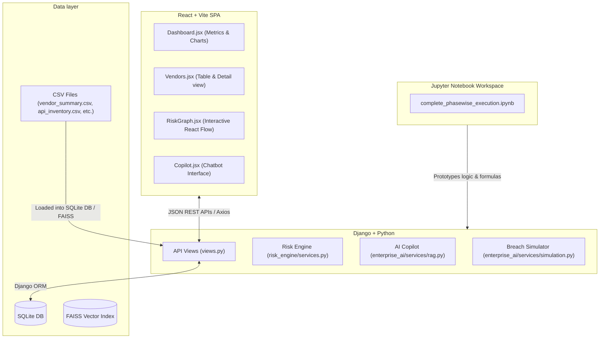
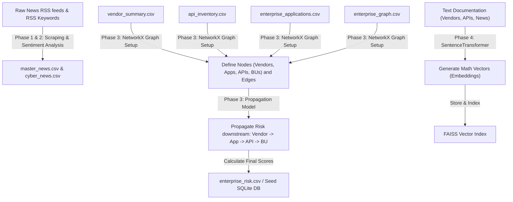
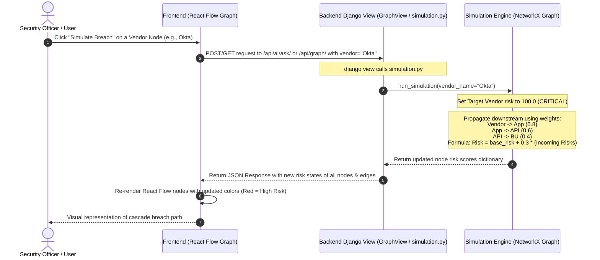
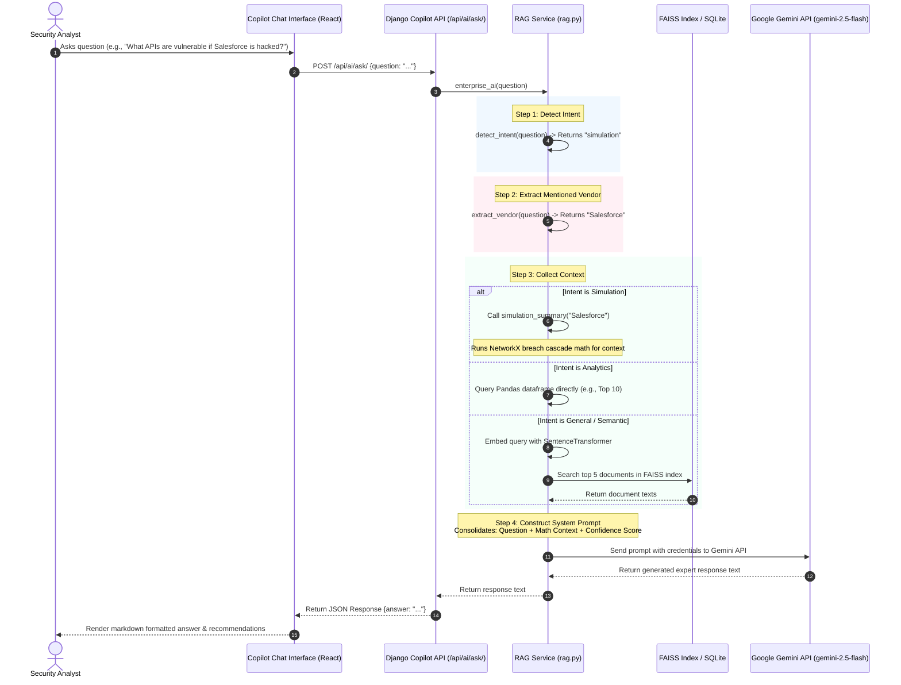

# Enterprise Risk Radar: Project Workflow Guide & Interview Prep

This guide provides a comprehensive visual and conceptual walkthrough of the **Enterprise Risk Radar** project workflow. Use it to understand the flow of data and systems, or as a reference to draw architecture diagrams on a whiteboard during an interview.

---

## 🏗️ 1. High-Level System Architecture

This project is a multi-tier risk intelligence application consisting of:
1. **Interactive Frontend (React + Vite)**: Visualizes data, metrics, dependencies, and lets users converse with the AI analyst.
2. **REST API Backend (Django + Django REST Framework)**: Manages business logic, risk calculations, and serves endpoints.
3. **Analytics & AI Engine (Python, NetworkX, FAISS, Gemini)**: Propagates risks mathematically and answers queries via Retrieval-Augmented Generation (RAG).
4. **Data Layer (SQLite & CSV Spreadsheets)**: Stores relational data, news alerts, and dependency weights.

---

## 🔄 2. End-to-End Data & Processing Workflow

The system is organized around four execution phases developed and prototyped in the Jupyter Notebook (`complete_phasewise_execution.ipynb`) and integrated into the backend production code.

### 1. Ingestion & Pre-processing (Phases 1 & 2)
*   **Action**: Scrapes news alerts and keywords (like "breach", "outage", "SEC penalty") for vendor risk feeds.
*   **Result**: Stores feeds in `cyber_news.csv` and counts keyword frequencies to calculate the **News Disruption Score** for vendors.

### 2. Relational Seeding & Database Loading
*   **Action**: Custom Django command-line scripts parse CSV spreadsheets and populate the relational tables in SQLite.
*   **Result**: Builds structural relations between Vendors, Enterprise Applications, APIs, and Business Units.

### 3. Graph Dependency Mapping (Phase 3)
*   **Action**: Uses Python's `NetworkX` library to construct a Directed Graph ($G$) where:
    *   **Nodes**: Represent Vendors, Apps, APIs, and Business Units.
    *   **Edges**: Represent direct relationships (e.g., Vendor feeds an Application).
    *   **Weights**: Establish downstream connection vulnerability levels (Vendor-to-App = $0.8$, App-to-API = $0.6$, API-to-BU = $0.4$).

---

## ⚡ 3. Feature-Specific Workflow Diagrams

If asked how a specific feature works end-to-end, present these sequence diagrams.

### Feature A: Breach Cascade Simulation
This flow is activated when a user selects a node in the React Flow graph and clicks **"Simulate Breach"**.

---

### Feature B: AI Copilot Analyst (RAG Pipeline)
This flow is activated when a user asks a question in the chatbot workspace. It uses a **Hybrid Intent Router** to determine whether to execute analytics, simulations, or perform semantic document retrieval.

---

## 🎯 4. Interview Cheat Sheet: Critical Questions & Answers

### Q1: How does the downstream Risk Propagation math work?
> **Answer**: 
> Risk propagates through the network based on the formula:
> $$\text{Propagated Risk} = \text{Base Risk} + \alpha \times \sum (\text{Parent Risk} \times \text{Edge Weight})$$
> where $\alpha$ (the propagation factor) is set to $0.3$. 
>
> 1. We model the dependencies as a directed graph ($G$) using `NetworkX`.
> 2. The source vendor's risk is forced to $100.0$ to simulate a complete breach.
> 3. Each child node (Application) inherits risk from its parent vendor multiplied by the edge weight ($0.8$).
> 4. This risk cascades down to APIs (weight $0.6$) and then to Business Units (weight $0.4$).
> 5. Finally, the risk scores are capped at $100.0$ and returned to the UI.

### Q2: How does the AI Assistant retrieve information? Isn't fine-tuning expensive?
> **Answer**: 
> We do not fine-tune the LLM. Instead, we use **RAG (Retrieval-Augmented Generation)**:
> 1. We construct plain-text summary documents for all vendors, APIs, and scrapings.
> 2. We use a lightweight local embedding model (`SentenceTransformer`) to convert these text blocks into vector representations.
> 3. We load these vectors into a local **FAISS (Facebook AI Similarity Search)** index.
> 4. When a user asks a question, we convert the query to a vector, find the top 5 most similar documents in FAISS, inject them as plain text context into a structured system prompt, and request **Google Gemini (gemini-2.5-flash)** to generate the final response.

### Q3: What is "Hybrid Intent Detection" in the AI Copilot?
> **Answer**:
> Pure vector search is bad at structural/analytical questions like *"Which vendor is the riskiest?"* or *"Simulate a hack on Salesforce"*. 
> To solve this, our RAG router (`detect_intent`) inspects the query:
> *   **Analytics queries** are routed to run direct Python/Pandas aggregation queries on the CSVs.
> *   **Simulation queries** trigger the NetworkX breach propagation logic on-the-fly and fetch the dependency tree.
> *   **General queries** default to the FAISS semantic vector search.
> This guarantees high accuracy and eliminates LLM hallucinations for structured risk calculations.
